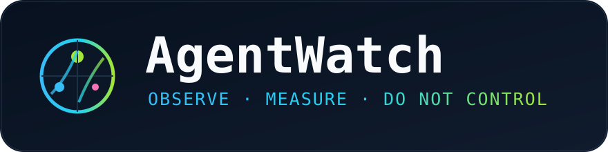
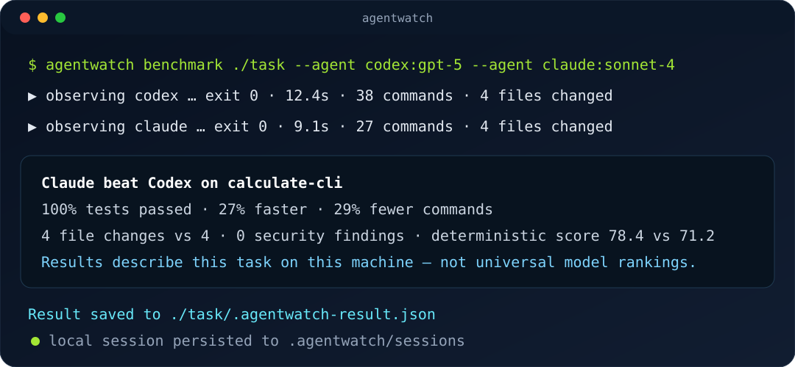
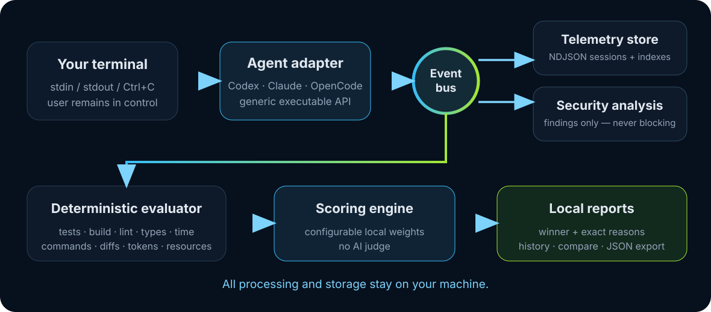

<div align="center">



# AgentWatch

**Local-first observability & deterministic benchmarking for autonomous coding agents.**

[](https://www.npmjs.com/package/@v01dst/agentwatch)
[](https://nodejs.org)
[](LICENSE)
[](#platform-support)

AgentWatch watches what an AI coding agent actually does, records a reproducible local event trail,
and measures results with deterministic checks. It never approves, denies, pauses, blocks, edits,
or judges the agent.

```text
observe what the agent does · measure how well it performs · show the user what happened
```

</div>

## Why AgentWatch

- **You keep control.** It is explicitly not a permission manager or intervention layer.
- **Local by design.** No account, cloud backend, hosted telemetry, API key, or external AI judge.
- **Transparent execution.** Normal stdin/stdout/stderr and `Ctrl+C`; no approval prompts injected.
- **Evidence over vibes.** Tests, build/lint/type-check status, timing, commands, diffs, errors, and optional token counts decide winners.
- **Secret-aware reporting.** Potential credentials are redacted before they reach reports.
- **Provider-neutral.** One normalized event stream works for any command-line agent.

<div align="center"></div>

## Install

### Global CLI

```bash
npm install -g @v01dst/agentwatch
agentwatch --help
```

### From source

```bash
git clone https://github.com/v01dst/agentwatch.git
cd agentwatch
npm install
npm run typecheck && npm test
npm run build
./bin/agentwatch.js --help
```

Requires Node.js 20 or newer. Linux and macOS are primary targets; Windows support is designed around platform-aware process spawning but needs broader real-world validation.

## Quick start

Observe an arbitrary agent exactly as you normally run it:

```bash
agentwatch run -- codex "fix the failing tests"
agentwatch run --adapter codex -- claude "refactor auth.ts"
agentwatch run -- opencode
agentwatch run --json -- node ./your-agent.js
```

Use `Ctrl+C` normally. AgentWatch forwards signals and records lifecycle information without taking control away from you.

Inspect what happened:

```bash
agentwatch history
agentwatch session <session-id>
agentwatch inspect <session-id> --json
agentwatch report <session-id>
```

<div align="center"></div>

## Deterministic benchmarks

Benchmark tasks are directories with source code and a `task.json`. Evaluation is based on measurable facts—not another model's opinion.

Example task:

```json
{
  "id": "calculate-cli",
  "description": "Implement a CLI that adds two integers and exits successfully",
  "setup": ["npm install"],
  "evaluation": ["node index.js 2 3"],
  "expectedOutput": "5",
  "scoringWeights": { "testPassRate": 50, "build": 25, "duration": 10 }
}
```

Run candidates:

```bash
agentwatch benchmark ./examples/benchmark-tasks/calculate-cli \
  --agent codex:gpt-5 \
  --agent claude:sonnet-4 \
  --agent opencode:model-x
agentwatch compare result-a.json result-b.json
```

The report names a winner only when configured scoring rules do, then explains why:

```text
Model X beat Model Y on the latest task
Why:
- tests passed: 100% vs 83%
- execution time: 9,100 ms vs 13,200 ms — 31% faster
- commands: 27 vs 39 — 31% fewer
- security findings: 0 vs 1
Weighted score: 78.4 vs 61.2
```

Measured dimensions include test pass rate, build/lint/type-check status, assertions, duration, command/error counts, file changes, resource samples, security findings, and token usage when exposed. Results are specific to your task, machine, prompt, environment, and run—not universal rankings.

## Security analysis

AgentWatch scans observed output and project state for:

- AWS, GitHub, OpenAI-style, Anthropic-style, and other common credential formats.
- Private keys, password/token assignments, `.env` files, high-entropy strings, and fingerprints.
- Sensitive path access/modification, risky shell patterns, dependency changes, and lifecycle scripts.
- Unexpected project modifications captured as filesystem/git events.

Findings are informational only. Evidence is redacted—for example `sk-a…[redacted]`—with a short SHA-256 fingerprint for correlation. AgentWatch never blocks the action that produced it.

## Commands

| Command | Purpose |
|---|---|
| `agentwatch run -- <command>` | Launch and observe an arbitrary agent |
| `agentwatch session <id>` | Print a stored event timeline |
| `agentwatch inspect <id> --json` | Machine-readable inspection payload |
| `agentwatch report <id>` | Human-readable session report |
| `agentwatch benchmark <dir>` | Run deterministic candidate comparisons |
| `agentwatch compare <a.json> <b.json>` | Compare saved benchmark results |
| `agentwatch history` | List locally recorded sessions |
| `agentwatch export <file>` | Copy a local artifact into exports |
| `agentwatch import <file>` | Import a benchmark/export artifact |

Useful global flags:

```bash
--json          machine-readable output where supported
--adapter name  force codex, claude, opencode, or generic
--model model   expose AGENTWATCH_MODEL to the child process
```

## Configuration

| Option | Meaning | Default |
|---|---|---|
| `AGENTWATCH_DATA_DIR` | Local data directory; absolute or resolved relative to the current directory | `<project>/.agentwatch` |
| `--adapter <name>` | Adapter selection; unknown adapters use the generic launcher | inferred |
| `--model <model>` | Exported as `AGENTWATCH_MODEL`; provider-specific flags belong in a wrapper script | unset |
| `--json` | Emit automation-friendly output | disabled |

All data remains under `.agentwatch/` by default:

```text
.agentwatch/
├── index/schema.json        schema migration marker (version 1)
├── index/sessions.json      atomic session catalog
├── index/benchmarks.json    atomic benchmark catalog
├── sessions/<id>.ndjson     append-only normalized events
└── exports/                 local import/export artifacts
```

## Adapter API

Adapters turn user arguments into a launch specification and may normalize provider metadata:

```ts
export interface AgentAdapter {
  name: string;
  launch(argv: string[], options: { cwd: string; model?: string }): AdapterLaunch;
  extractTokenUsage?(stdout: string, stderr: string): { input?: number; output?: number };
}
```

Built-ins include `codex`, `claude`, and `opencode`, plus a generic fallback. Adapters cannot intercept approvals or change agent decisions. A wrapper script can add model-specific flags while remaining fully local.

Example shape:

```json
{
  "name": "my-agent",
  "command": ["your-agent", "--flag"],
  "tokenUsage": "optional extraction hook"
}
```

See [`examples/agents/generic.json`](examples/agents/generic.json).

## Extending evaluation

Keep evaluation deterministic and reproducible. Good signals include:

- Exact exit codes and parsed pass/fail totals.
- Build, lint, type-check, formatting, and task-specific assertion scripts.
- Git diff statistics, filesystem-change counts, and expected-output comparisons.
- Duration, error count, command count, CPU/RSS samples, and optional token usage.
- Security finding counts when risk is relevant to your task.

Task-specific evaluators can emit additional metrics through adapters or wrapper scripts. Store weights in versioned task configuration so reruns remain comparable.

## Development

```bash
npm install
npm run dev
npm run typecheck
npm test
npm run build
npm pack --dry-run
```

The suite covers scoring, secret redaction, storage migrations, process observation, lifecycle events, and transparent child-process behavior. Contributions must preserve the observe-only boundary and local-only data flow—see [CONTRIBUTING.md](CONTRIBUTING.md).

## Privacy model

AgentWatch has no telemetry endpoint. Source code, prompts, logs, secrets, benchmarks, reports, and exports stay on disk unless you choose to move them. Network/file/process observations are recorded locally from information visible to the parent process; AgentWatch does not inject itself into the agent.

It is not antivirus, sandboxing, permission enforcement, or exfiltration prevention. Review generated code before running, committing, or publishing it.

## Platform support

| Platform | Status |
|---|---|
| Linux | Primary development/test target |
| macOS | Supported target using Node portable APIs |
| Windows | Architecturally planned; spawn/path handling is isolated, but requires broader testing |

Process-tree accounting and network attribution vary by OS. Those capabilities are extension points rather than hard-coded assumptions.

## FAQ

**Does AgentWatch approve or block dangerous actions?**
No. It reports findings only. Stop an agent yourself with normal terminal controls such as `Ctrl+C`.

**Can it rank models universally?**
No. Benchmarks produce local, task-specific measurements and should never be generalized as universal leaderboards.

**Where does my data go?**
Nowhere automatically. It stays under `.agentwatch/` unless you export or copy it.

**Does it need an AI judge?**
No. Deterministic scoring uses tests, build status, timing, diffs, counters, and other observable metrics.

**Can I observe any CLI agent?**
Yes. The generic launcher runs arbitrary executables; adapters improve normalization and token extraction.

## Roadmap

- Deeper per-command attribution across process trees.
- Optional OS-specific network observation adapters.
- More provider token-usage extractors.
- Richer local TUI dashboards and saved leaderboard views.
- Expanded Windows validation and packaging tests.

## Community

Questions, feedback, or integration help? Discord: **`9p.1`**

Issues and pull requests are welcome on [GitHub](https://github.com/v01dst/agentwatch). Please include reproduction steps, local redacted logs, OS/Node versions, and expected versus actual behavior.

## License

[Apache-2.0](LICENSE)
